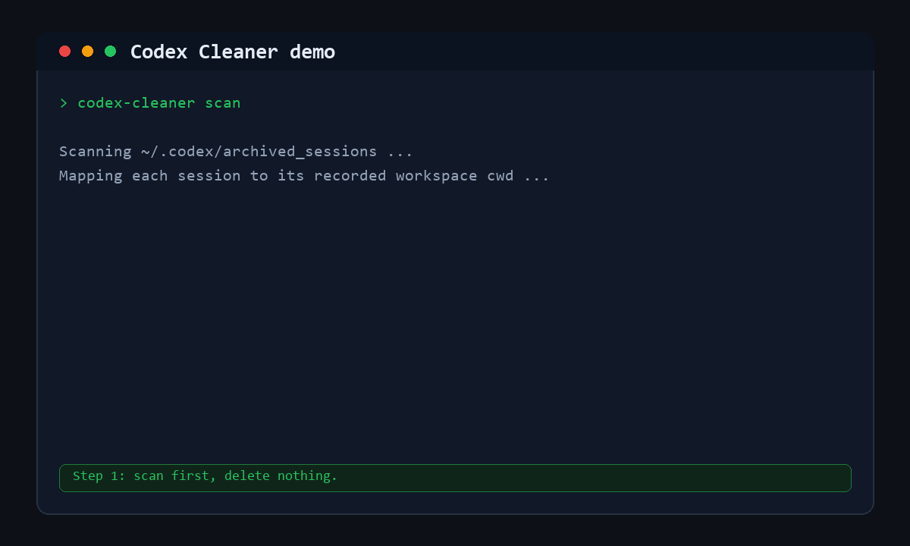

# Codex Cleaner

Codex Cleaner 用来安全清理本地 Codex 归档会话，以及这些会话生成的本地项目文件。



它解决的问题很直接：

> 这个归档的 Codex 对话到底生成了哪些本地文件？我能不能放心删掉？

第一版重点支持 Windows 上的 Codex Desktop 目录结构。

## 功能

- 扫描 `~/.codex/archived_sessions` 里的归档会话记录。
- 读取每个会话记录里的 `cwd`，找到对应本地项目目录。
- 显示项目是否存在、文件数量、目录数量、占用空间。
- 支持删除归档会话记录、项目目录，或者两者一起删除。
- 默认移动到 `~/Documents/Codex_Trash`，不是直接永久删除。
- 默认只允许清理 `~/Documents/Codex` 里的项目，避免误删其他目录。
- 检测多个归档会话是否指向同一个项目目录。

## 使用

扫描归档会话：

```powershell
python .\scripts\codex_cleaner.py scan
```

扫描表会显示 `Title` 列，也就是从对话里的第一条真实用户需求自动生成的可读名称。中文和英文对话名称都支持，也会尽量跳过常见的文件上传前缀。

输出 JSON：

```powershell
python .\scripts\codex_cleaner.py scan --json
```

按表格编号预览清理某个会话和它的项目目录：

```powershell
python .\scripts\codex_cleaner.py clean --index 3 --target both
```

按对话名称关键词预览清理：

```powershell
python .\scripts\codex_cleaner.py clean --title "认证机构" --target both
```

英文关键词也可以：

```powershell
python .\scripts\codex_cleaner.py clean --title "certification agency" --target both
```

按会话 ID 预览清理：

```powershell
python .\scripts\codex_cleaner.py clean --session-id 019e25e9 --target both
```

真正执行清理，默认移动到 `Codex_Trash`：

```powershell
python .\scripts\codex_cleaner.py clean --session-id 019e25e9 --target both --yes
```

对非专业用户，推荐固定这样用：

```powershell
python .\scripts\codex_cleaner.py scan
python .\scripts\codex_cleaner.py clean --index 3 --target both
python .\scripts\codex_cleaner.py clean --index 3 --target both --yes
```

只清理指定项目目录：

```powershell
python .\scripts\codex_cleaner.py clean --project "C:\Users\you\Documents\Codex\2026-05-14\windows" --target project --yes
```

## 安全原则

- `clean` 默认只是 dry-run，必须加 `--yes` 才会执行。
- 默认移动到 `~/Documents/Codex_Trash`。
- 永久删除必须显式加 `--permanent --yes`。
- 默认不会删除 `~/Documents/Codex` 之外的项目。
- 本工具只清理本地文件和本地归档日志，不会删除云端 ChatGPT/Codex 历史。
- 本工具在本地运行，不会把会话记录或文件内容发送到远程服务。
- 支持按表格编号、对话名称关键词、会话 ID、归档文件名、项目路径进行清理。

## Codex Skill 安装

项目包含 Codex Skill：

`skills/codex-cleaner`

发布到 GitHub 后，可以这样安装：

```text
$skill-installer install https://github.com/manganeseboy/codex-cleaner/tree/main/skills/codex-cleaner
```

## 许可证

MIT
